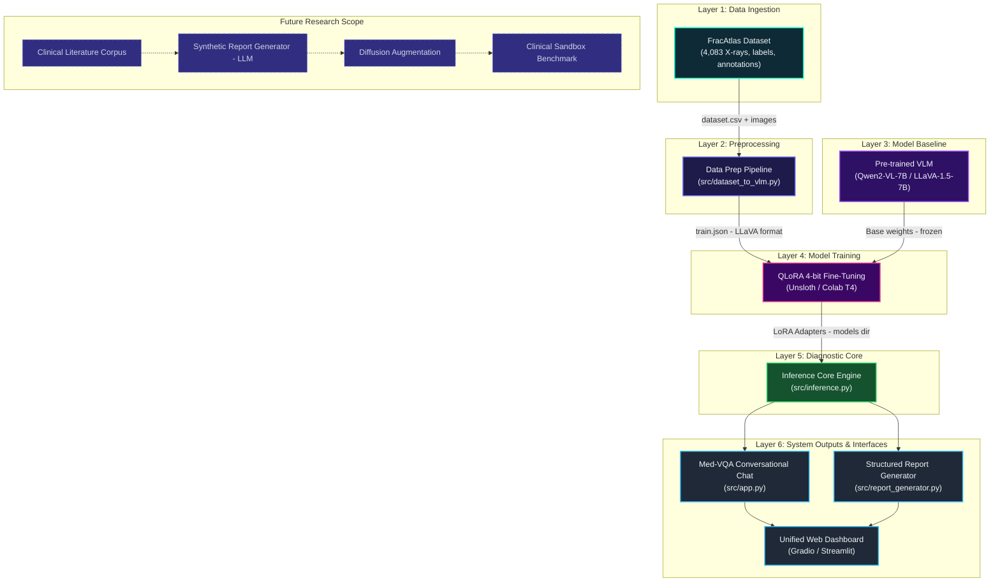

# System Architecture: Medical Vision-Language Model (FracAtlas VLM)

This document describes the complete neural architecture, data pipelines, model hierarchy, and runtime interfaces for the **FracAtlas Medical Vision-Language Model (VLM)**.

---

## 1. High-Level Architecture Overview

The platform specializes large multimodal models (such as **Qwen2-VL-7B-Instruct** and **LLaVA-1.5-7B**) for orthopedic diagnostics. It ingests musculoskeletal X-ray imagery, performs parameter-efficient fine-tuning (PEFT via QLoRA 4-bit), and powers interactive conversational chat (Med-VQA) alongside automated clinical report generation.



---

## 2. Layer-by-Layer Architectural Breakdown

### Layer 1: Data Ingestion (`dataset`)
* **Primary Source**: FracAtlas dataset (musculoskeletal radiographs with expert annotations).
* **Composition**:
  * 4,083 high-resolution X-ray images (717 fractured, 3,366 normal/non-fractured).
  * Multiple anatomic regions (hand, wrist, leg, shoulder, foot, elbow, knee, ankle).
  * Multi-format ground truth: bounding boxes and masks in COCO, YOLO, VGG, and Pascal VOC formats.
* **Storage Location**: `data/raw/FracAtlas/` *(excluded from Git due to file size, downloaded via `download_dataset.py`)*.

---

### Layer 2: Preprocessing Pipeline (`data_prep`)
* **Core Script**: `src/dataset_to_vlm.py`
* **Output**: `data/processed/train.json`
* **Role**:
  * Converts tabular image metadata (`dataset.csv`) and bounding annotations into multi-turn vision-language conversation pairs.
  * Formats data according to the standard LLaVA / ShareGPT multimodal schema:
    ```json
    [
      {
        "id": "frac_00123",
        "image": "images/IMG00123.jpg",
        "conversations": [
          {"from": "human", "value": "<image>\nExamine this musculoskeletal radiograph. Identify any fracture or hardware present."},
          {"from": "gpt", "value": "FINDINGS: There is a displaced fracture across the distal radius. No internal fixation hardware is observed. Impression: Acute distal radius fracture."}
        ]
      }
    ]
    ```

---

### Layer 3: Model Baseline (`pretrained`)
* **Base Models**:
  * `Qwen/Qwen2-VL-7B-Instruct`
  * `llava-hf/llava-1.5-7b-hf`
* **Characteristics**: Pre-trained on billions of general image-text pairings; provides foundational spatial and semantic visual comprehension before medical adaptation.

---

### Layer 4: Model Training (`training`)
* **Orchestrator**: `notebooks/train_vlm.ipynb` / `src/train_vlm.py`
* **Methodology**:
  * **Quantization**: 4-bit NormalFloat (NF4) via BitsAndBytes.
  * **PEFT**: Low-Rank Adaptation (LoRA / QLoRA) targeting attention projection weights (`q_proj`, `k_proj`, `v_proj`, `o_proj`).
  * **Acceleration**: Unsloth on Google Colab T4 / A100 GPU environments.
  * **Artifacts**: Lightweight adapter weights saved to `models/` (`adapter_config.json`, `adapter_model.safetensors`).

---

### Layer 5: Diagnostic Core (`core`)
* **Script**: `src/inference.py`
* **Role**:
  * Loads the base vision-language model in 4-bit precision and attaches the trained LoRA adapter.
  * Provides batch and single-sample inference APIs with specialized prompt templates.
  * Outputs standardized radiological findings and impressions.

---

### Layer 6: User Interfaces & System Outputs (`vqa`, `reports`, `webui`)
* **Med-VQA Chat (`src/app.py`)**:
  * Interactive multimodal chat interface enabling clinicians or researchers to query specific X-rays (e.g., *"Is there bone cortical disruption at the distal end?"*).
* **Report Generator (`src/report_generator.py`)**:
  * Transforms raw VLM reasoning into structured clinical PDF reports adhering to standard radiology formats.
* **Unified Web Dashboard (`webui`)**:
  * Integrated web UI combining drag-and-drop X-ray upload, real-time bounding overlays, chat feed, and one-click PDF generation.

---

## 3. How to Run the Interactive Architecture Dashboard Locally

The repository includes a built-in neural architecture visualizer that project members can run on their local machines.

### Key Highlights
- **Zero External Dependencies**: Uses only the Python standard library (`http.server`, `threading`, `json`, `os`). No `pip install` required!
- **Dynamic File Scanner**: Continuously monitors the repository filesystem every 10 seconds and highlights completed vs pending modules in real time.
- **Node Inspector**: Click on any node to view its inputs, outputs, files, purpose, and dependencies.

### Step-by-Step Instructions

1. Open your terminal in the repository root directory:
   ```bash
   cd medical-vlm-fracatlas
   ```

2. Start the dashboard server:
   ```bash
   python3 dashboard/serve.py
   ```

3. Open your browser and navigate to:
   ```text
   http://localhost:8080
   ```

4. **Interacting with the Architecture**:
   - **Left Sidebar**: Shows the list of all architecture modules and their live status (**Complete**, **In Progress**, **Pending**, **Future**).
   - **Main Canvas**: Hierarchical vertical neural layout with glowing connection pathways and particles.
   - **Right Details Panel**: Click any node (e.g., `FracAtlas Dataset`, `Diagnostic Core`, `VLM Fine-Tuning`) to inspect its purpose, code files, and upstream dependencies.

---

## 4. Future Research Extensions

| Module | Identifier | Purpose |
| :--- | :--- | :--- |
| **Clinical Literature Corpus** | `literature` | Ingestion of textbooks and journal articles covering rare orthopedic anomalies. |
| **Synthetic Report Generator** | `synth_reports` | LLM agent synthesizing detailed clinical profiles for rare musculoskeletal conditions. |
| **Diffusion Augmentation** | `diffusion` | Latent diffusion generation of synthetic X-ray variations for data augmentation. |
| **Clinical Sandbox Benchmark** | `sandbox` | Automated evaluation against external radiologist-graded validation sets. |
