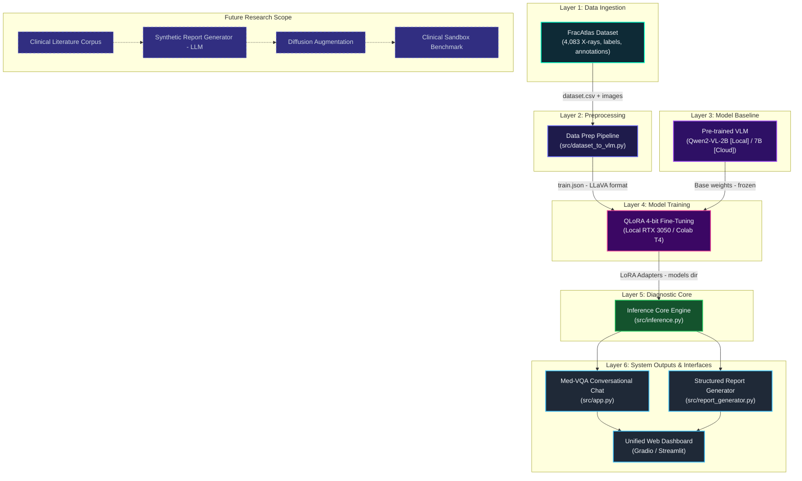

# System Architecture: Medical Vision-Language Model (FracAtlas VLM)

This document describes the complete neural architecture, data pipelines, model hierarchy, and runtime interfaces for the **FracAtlas Medical Vision-Language Model (VLM)**.

---

## 1. High-Level Architecture Overview

The platform specializes large multimodal vision-language models for orthopedic diagnostics. It ingests musculoskeletal X-ray imagery, performs parameter-efficient fine-tuning (PEFT via QLoRA 4-bit), and powers interactive conversational chat (Med-VQA) alongside automated clinical report generation.

To ensure total accessibility across different student and lab workstations, the architecture employs a **Dual-Engine Strategy**:
* **Local Workstation Engine (Default)**: `Qwen2-VL-2B-Instruct` — optimized for consumer gaming laptops with 6 GB VRAM (e.g. Dell G15 with NVIDIA RTX 3050 6GB). Peak training VRAM is only **~3.5 – 4.5 GB**, enabling 100% on-device training, inference, and WebUI without cloud dependency.
* **Cloud Benchmark Engine**: `Qwen2-VL-7B-Instruct` / `LLaVA-1.5-7B` — designed for 16 GB+ VRAM GPUs (Google Colab T4 / A100) for comparative research benchmarks.



---

## 2. Layer-by-Layer Architectural Breakdown

### Layer 1: Data Ingestion (`dataset`)
* **Primary Source**: FracAtlas dataset (musculoskeletal radiographs with expert annotations).
* **Composition**:
  * 4,083 high-resolution X-ray images (717 fractured, 3,366 normal/non-fractured).
  * Multiple anatomic regions (hand, wrist, leg, shoulder, foot, elbow, knee, ankle).
  * Multi-format ground truth: bounding boxes and masks in COCO, YOLO, VGG, and Pascal VOC formats.
* **Storage Location**: `data/raw/FracAtlas/` *(excluded from Git due to file size, downloaded via `download_dataset.py`)*.

---

### Layer 2: Preprocessing Pipeline (`data_prep`)
* **Core Script**: `src/dataset_to_vlm.py`
* **Outputs**: `data/processed/train.json`, `data/processed/val.json`
* **Role**:
  * Parses tabular image metadata, fracture splits (`train.csv`, `valid.csv`), and segmentation/bounding masks (`COCO_fracture_masks.json`).
  * Generates diverse clinical conversation pairs (fracture localization, anatomical identification, normal radiograph negative controls).
  * Formats data according to the standard LLaVA / ShareGPT multimodal schema:
    ```json
    [
      {
        "id": "frac_00123",
        "image": "images/IMG00123.jpg",
        "conversations": [
          {"from": "human", "value": "<image>\nExamine this musculoskeletal radiograph. Identify any fracture or hardware present."},
          {"from": "gpt", "value": "FINDINGS: There is a displaced fracture across the distal radius. No internal fixation hardware is observed. Impression: Acute distal radius fracture."}
        ]
      }
    ]
    ```

---

### Layer 3: Model Baseline (`pretrained`)

The repository supports a **Dual-Engine Architecture** to guarantee that every team member can run and train the system regardless of whether they have a consumer gaming laptop or cloud compute:

| Engine Tier | Foundation Model | Parameters | Quantized VRAM | Target Hardware | Primary Use Case |
| :--- | :--- | :--- | :--- | :--- | :--- |
| **Tier 1 (Local-First)** | `Qwen/Qwen2-VL-2B-Instruct` | 2.2 Billion | **~1.5 GB** | **6 GB VRAM GPUs** (RTX 3050 Laptop / Dell G15) | **100% on-device training & offline inference** |
| **Tier 2 (Cloud / Research)** | `Qwen/Qwen2-VL-7B-Instruct` / `llava-1.5-7b-hf` | 7.0 Billion | **~4.8 GB** | **16 GB+ VRAM GPUs** (Google Colab T4 / A100) | Comparative scaling and academic benchmark |

#### Why Qwen2-VL-2B is the Ideal Local Baseline:
* In 4-bit NormalFloat (NF4), model weights take just **~1.5 GB VRAM**.
* Even after adding dynamic image tokens, LoRA adapter weights, and optimizer states with gradient checkpointing, peak VRAM during training is only **~3.5 GB to 4.5 GB**.
* **Zero Out-of-Memory (OOM) risk** on 6 GB consumer GPUs like NVIDIA RTX 3050 Laptop GPU.

---

### Layer 4: Model Training (`training`)
* **Local Training Script**: `src/train_vlm.py` *(tuned for 6 GB GPUs with batch size = 1, gradient accumulation = 4, gradient checkpointing)*.
* **Cloud Training Notebook**: `notebooks/train_vlm.ipynb` *(Google Colab T4 compatible)*.
* **Methodology**:
  * **Quantization**: 4-bit NormalFloat (NF4) via BitsAndBytes (`load_in_4bit=True`).
  * **PEFT (LoRA)**: Targets vision-language attention projections (`q_proj`, `k_proj`, `v_proj`, `o_proj`).
  * **Artifacts**: Lightweight adapter weights saved to `models/` (`adapter_config.json`, `adapter_model.safetensors`, approx ~100–250 MB).

---

### Layer 5: Diagnostic Core (`core`)
* **Script**: `src/inference.py`
* **Role**:
  * Loads base model in 4-bit and attaches the trained LoRA adapter from `models/`.
  * Exposes programmatic APIs for clinical evaluation:
    - `diagnose_xray(image_path)` -> Returns findings, fracture presence, and impression.
    - `answer_clinical_query(image_path, question)` -> Interactive Med-VQA.
  * Runs in real-time on local RTX 3050 (takes < 2 seconds per X-ray).

---

### Layer 6: User Interfaces & System Outputs (`vqa`, `reports`, `webui`)
* **Med-VQA Chat (`src/app.py`)**:
  * Interactive multimodal chat interface enabling clinicians or researchers to query specific X-rays (e.g., *"Is there bone cortical disruption at the distal end?"*).
* **Report Generator (`src/report_generator.py`)**:
  * Transforms raw VLM reasoning into structured clinical PDF reports adhering to standard radiology formats.
* **Unified Web Dashboard (`webui`)**:
  * Integrated web UI combining drag-and-drop X-ray upload, real-time bounding overlays, chat feed, and one-click PDF generation.

---

## 3. Hardware Profiles & Resource Allocation Guide

### Profile A: Local Consumer Gaming Laptop (Recommended Local Configuration)
* **Tested Hardware**: Dell G15 5530 (13th Gen Intel Core i5-13450HX, 16 GB DDR5 RAM, NVIDIA GeForce RTX 3050 Laptop GPU 6 GB VRAM, Windows 11).
* **Capabilities**:
  * ✅ Neural Architecture Dashboard (Runs with 0% GPU, < 50 MB RAM).
  * ✅ Data Preprocessing Pipeline (Runs on CPU in ~1–2 minutes).
  * ✅ QLoRA 4-bit Training of `Qwen2-VL-2B-Instruct` (Peaks at ~3.8 GB / 6 GB VRAM).
  * ✅ Real-time Local Inference & Diagnostic Chat (< 2.5 GB VRAM).
  * ✅ PDF Clinical Report Generation & Gradio WebUI.
* **Note for 7B Models**: Fine-tuning a 7B model locally on a 6 GB card will encounter CUDA Out-of-Memory (OOM) due to multimodal visual tokens. Use Profile B for 7B training.

### Profile B: Cloud GPU (Google Colab / Kaggle)
* **Hardware**: Google Colab Free Tier (NVIDIA Tesla T4 16 GB VRAM) or Pro (A100).
* **Capabilities**:
  * ✅ Full training of `Qwen2-VL-7B-Instruct` and `LLaVA-1.5-7B`.
  * Export the generated `models/` LoRA adapter folder (~150 MB) and download it to your local laptop to run inference locally!

---

## 4. End-to-End Implementation Roadmap for Team Members

Follow these sequential steps to run or contribute to any phase of the project:

```
[Step 1: Setup] ──> [Step 2: Dataset] ──> [Step 3: Data Prep] ──> [Step 4: Train] ──> [Step 5: Infer] ──> [Step 6: UI & Reports]
```

### Step 1: Environment Setup
Clone the repository and install dependencies:
```bash
# Clone
git clone https://github.com/Sahanawazhussain/medical-vlm-fracatlas.git
cd medical-vlm-fracatlas

# Install dependencies (Windows with CUDA 12.1)
pip install torch torchvision --index-url https://download.pytorch.org/whl/cu121
pip install -r requirements.txt
```

### Step 2: Ingest Raw Dataset
If not already downloaded, fetch the 4,083 FracAtlas radiographs:
```bash
python download_dataset.py
```

### Step 3: Run Multimodal Data Preprocessing
Convert raw images and COCO bounding annotations into VLM instruction-tuning format:
```bash
python src/dataset_to_vlm.py
```
*Output*: Generates `data/processed/train.json` and `data/processed/val.json`.

### Step 4: Fine-Tune the Vision-Language Model
* **Option 1 (Local Laptop - 100% Offline)**:
  ```bash
  python src/train_vlm.py --model Qwen/Qwen2-VL-2B-Instruct --batch_size 1 --epochs 3
  ```
* **Option 2 (Google Colab - 7B Cloud Benchmark)**:
  Open `notebooks/train_vlm.ipynb` in Colab, select T4 GPU, run all cells, and save adapter to `models/`.

### Step 5: Test Diagnostic Core Engine
Verify that the model accurately detects fractures and outputs structured radiological findings:
```bash
python src/inference.py --image data/raw/FracAtlas/FracAtlas/images/Fractured/IMG0000019.jpg
```

### Step 6: Launch Med-VQA Chat & Clinical Report Generator
Launch the unified web interface:
```bash
python src/app.py
```
Open `http://localhost:7860` to upload any radiograph, chat with the diagnostic model, and generate official radiology PDF reports.

---

## 5. How to Run the Interactive Architecture Dashboard Locally

The repository includes a built-in neural architecture visualizer that project members can run on their local machines.

### Key Highlights
- **Zero External Dependencies**: Uses only the Python standard library (`http.server`, `threading`, `json`, `os`). No `pip install` required!
- **Dynamic File Scanner**: Continuously monitors the repository filesystem every 10 seconds and highlights completed vs pending modules in real time.
- **Node Inspector**: Click on any node to view its inputs, outputs, files, purpose, and dependencies.

### Step-by-Step Instructions

1. Open your terminal in the repository root directory:
   ```bash
   cd medical-vlm-fracatlas
   ```

2. Start the dashboard server:
   ```bash
   python3 dashboard/serve.py
   ```

3. Open your browser and navigate to:
   ```text
   http://localhost:8080
   ```

4. **Interacting with the Architecture**:
   - **Left Sidebar**: Shows the list of all architecture modules and their live status (**Complete**, **In Progress**, **Pending**, **Future**).
   - **Main Canvas**: Hierarchical vertical neural layout with glowing connection pathways and particles.
   - **Right Details Panel**: Click any node (e.g., `FracAtlas Dataset`, `Diagnostic Core`, `VLM Fine-Tuning`) to inspect its purpose, code files, and upstream dependencies.

---

## 6. Future Research Extensions

| Module | Identifier | Purpose |
| :--- | :--- | :--- |
| **Clinical Literature Corpus** | `literature` | Ingestion of textbooks and journal articles covering rare orthopedic anomalies. |
| **Synthetic Report Generator** | `synth_reports` | LLM agent synthesizing detailed clinical profiles for rare musculoskeletal conditions. |
| **Diffusion Augmentation** | `diffusion` | Latent diffusion generation of synthetic X-ray variations for data augmentation. |
| **Clinical Sandbox Benchmark** | `sandbox` | Automated evaluation against external radiologist-graded validation sets. |
