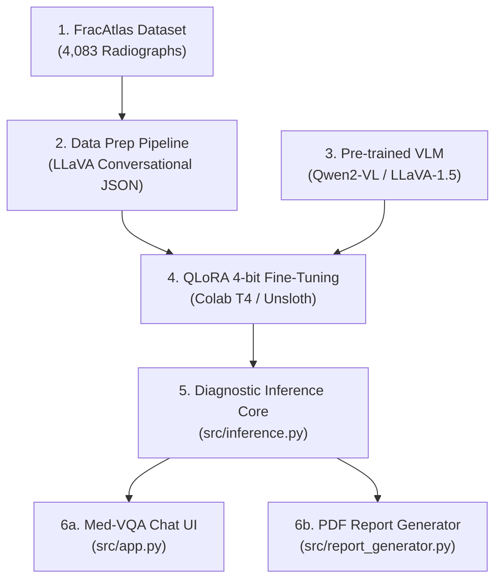

# 🦴 FracAtlas Medical Vision-Language Model (VLM)

> Multimodal Vision-Language Model for Musculoskeletal Fracture Detection, Visual Question Answering (Med-VQA), and Automated Diagnostic Report Generation.

---

## 📌 Table of Contents
- [Overview](#overview)
- [Neural Architecture](#neural-architecture)
- [⚠️ Important: Dataset File Size & Git Exclusion Policy](#️-important-dataset-file-size--git-exclusion-policy)
- [🚀 Quickstart for Project Members](#-quickstart-for-project-members)
  - [1. Clone Repository](#1-clone-repository)
  - [2. View Architecture Dashboard Locally (Zero Dependencies!)](#2-view-architecture-dashboard-locally-zero-dependencies)
  - [3. Download FracAtlas Dataset Locally](#3-download-fracatlas-dataset-locally)
- [📂 Project Directory Layout](#-project-directory-layout)
- [👥 Contributors & Project Team](#-contributors--project-team)
- [📄 Documentation](#-documentation)

---

## Overview

This project builds an end-to-end medical AI diagnostic pipeline based on the **FracAtlas** musculoskeletal radiograph dataset. Using Parameter-Efficient Fine-Tuning (**QLoRA 4-bit**) on modern Vision-Language Models (such as **Qwen2-VL-7B-Instruct** or **LLaVA-1.5-7B**), the system enables:
1. **Accurate Fracture Detection & Localization** on raw musculoskeletal X-rays.
2. **Interactive Med-VQA Chat**: Natural-language clinical dialogue with images.
3. **Automated Structured Report Generation**: Formatting diagnostic findings and impressions into downloadable clinical reports.

---

## Neural Architecture

The end-to-end system consists of 6 primary layers and an extensible future research module:



> 📖 For an in-depth architectural breakdown, see [ARCHITECTURE.md](file:///Users/sahanawazhussain/PROJECT/ARCHITECTURE.md).

---

## ⚠️ Important: Dataset File Size & Git Exclusion Policy

> [!WARNING]
> ### 🛑 Why Raw Datasets and Model Weights Are NOT Tracked in Git
>
> 1. **GitHub File Size Limits**:
>    - GitHub rejects files larger than **100 MB** and issues warnings for files over **50 MB**.
>    - The total repository size is strongly recommended to stay under **1 GB** (ideally < 500 MB) for smooth cloning and syncing.
> 2. **FracAtlas Dataset Size**:
>    - The raw FracAtlas archive contains **4,083 high-resolution X-ray images** taking up approximately **352 MB** uncompressed.
> 3. **Model Binaries**:
>    - PyTorch and HuggingFace weights (`*.safetensors`, `*.pt`, `*.bin`, `*.gguf`) can easily exceed **4 GB to 14 GB**.
>
> **Best Practice Solution implemented in this repository**:
> - All heavy images (`data/raw/FracAtlas/`), processed caches, and model binary files are safely excluded in [.gitignore](file:///Users/sahanawazhussain/PROJECT/.gitignore).
> - Directory structures are preserved using `.gitkeep`.
> - **Every team member can download the dataset with a single command** using the automated script:
>   ```bash
>   python3 download_dataset.py
>   ```

---

## 🚀 Quickstart for Project Members

### 1. Clone Repository
```bash
git clone https://github.com/Sahanawaz233/medical-vlm-fracatlas.git
cd medical-vlm-fracatlas
```

### 2. View Architecture Dashboard Locally (Zero Dependencies!)
We built an interactive, dynamic neural architecture visualizer into the repository. It runs directly on Python's built-in standard library without needing to install any packages!

```bash
python3 dashboard/serve.py
```

Once running, open your web browser to:
```text
http://localhost:8080
```

#### What you will see:
* **Interactive Neural Diagram**: Visual representation of the data ingestion, preprocessing, training, inference core, and output layers.
* **Live Project Scanner**: The background server automatically checks your project folders every 10 seconds and dynamically updates the completion status of each module (Complete, In Progress, Pending).
* **Detailed Node Inspector**: Click on any node to view descriptions, upstream dependencies, and relevant file paths.

### 3. Download FracAtlas Dataset Locally
To retrieve the full dataset onto your local workstation:
```bash
python3 download_dataset.py
```
This script will:
* Fetch the official FracAtlas release from Figshare (approx. 322 MB zip).
* Extract all 4,083 musculoskeletal X-rays into `data/raw/FracAtlas/`.
* Automatically clean up the temporary zip file upon completion.

---

## 📂 Project Directory Layout

```text
medical-vlm-fracatlas/
├── ARCHITECTURE.md          # Detailed neural architecture & layer specs
├── README.md                # Project documentation & member guide
├── .gitignore               # Excludes large images, model checkpoints, OS files
├── download_dataset.py      # Automated dataset downloader & unpacker
├── dashboard/               # Interactive Neural Architecture Visualizer
│   ├── index.html           # Modern dark-mode architecture dashboard UI
│   ├── serve.py             # Zero-dependency Python server with live file scanner
│   └── status.json          # Live status state generated by scanner
├── data/
│   ├── raw/                 # Contains FracAtlas images (populated via download_dataset.py)
│   └── processed/           # Formatted LLaVA-style JSON training files
├── models/                  # Trained LoRA adapter weights (adapter_config.json, etc.)
├── notebooks/               # Colab / Jupyter fine-tuning notebooks (train_vlm.ipynb)
└── src/                     # Core codebase
    ├── dataset_to_vlm.py    # Preprocessing script (dataset.csv -> train.json)
    ├── inference.py         # Diagnostic inference engine
    ├── app.py               # Med-VQA interactive chat application
    └── report_generator.py  # Structured medical PDF report generator
```

---

## 👥 Contributors & Project Team

* **Sahanawaz Hussain** ([@Sahanawaz233](https://github.com/Sahanawaz233)) - Project Lead
* **Aryan** ([@Aryaxnk](https://github.com/Aryaxnk)) - Project Member / Contributor
* **Pranita** ([@pranita157](https://github.com/pranita157)) - Project Member / Contributor

---

## 📄 Documentation

* [Architecture Specification](file:///Users/sahanawazhussain/PROJECT/ARCHITECTURE.md)
* [Interactive Visualizer Guide](file:///Users/sahanawazhussain/PROJECT/ARCHITECTURE.md#3-how-to-run-the-interactive-architecture-dashboard-locally)
